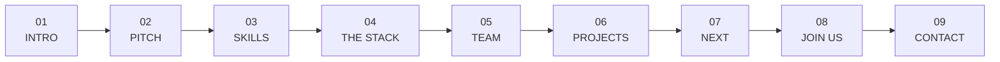

<div align="center">

# ✦ TEAM99 ✦

### **The page doesn't scroll. You fly through it.**

A single-page portfolio where scroll input drives a camera through a 3D starfield.
Nine sections sit at their own stations in depth and fly toward you out of the dark.

<br>


**`~2,000 lines`** · **`63 KB total`** · **`no framework`** · **`no bundler`** · **`no node_modules`**

</div>

---

## What this is

A portfolio for **Team99** — three B.Tech students at Gyan Ganga Institute of Technology &
Sciences (GGITS), Jabalpur, studying IoT & Cyber Security including Blockchain Technology.

But mostly it's an excuse to build a 3D camera rig in a 2D canvas with no libraries.

---

## The flight interface

Scrolling doesn't move the document — it moves a **camera**. Each section is a station at a
fixed depth. Travel toward one and it scales up, sharpens, and fades in out of blackness.

```
        far                                                          lens
         ·    ·      ·          ·       ·     ·        ·    ·     ·
    ┌──┐        ┌──┐         ┌───┐          ┌────┐        ┌──────────┐
    │09│        │08│         │07│           │ 06 │        │    05    │ ◄── you
    └──┘        └──┘         └───┘          └────┘        └──────────┘
       ·     ·        ·    ·        ·    ·         ·   ·        ·
    invisible ──── fading up ──── legible ──── soft ──────── in focus
    ◄──────────────────────── depth (z) ────────────────────────────►
```

The opacity falloff is **steeply exponential on purpose**. A gentler ramp left the *next*
section legible in the middle of the current one — you could read the Skills list straight
through the Intro. At this rate one station ahead lands below the cull threshold, so a
section is genuinely invisible until you move toward it.



---

## Under the hood

<details>
<summary><b>🌌 The starfield renderer</b> — 1,250 stars in a handful of draw calls</summary>

<br>

Stars are projected with a real perspective divide (`k = FOV / z`) and wrapped in depth so
the field is endless. The naive approach — one `fill()` per star — costs 1,250 separate paths
per frame. Instead:

- Stars are **quantised into 5 alpha buckets**, each filled in a single batched pass
- Big stars get `arc()`; anything under ~1.2px gets `rect()`, because at a pixel or two a
  square is indistinguishable from a disc and cheaper to rasterise
- Positions live in preallocated `Float32Array` buffers — no per-frame allocation
- The bokeh orbs share **one pre-rendered sprite**. Building radial gradients per orb per
  frame was allocating 14 gradient objects every frame; now it's drawn once and blitted

When you travel fast enough, stars switch to **warp streaks** — one shared path, stroked
once, instead of a `stroke()` per star.

</details>

<details>
<summary><b>🎞️ Frame-rate independence</b> — identical at 60, 120, 144 and 165Hz</summary>

<br>

Every easing constant was originally tuned against a 60Hz frame and applied once per frame,
so the whole animation ran at *the monitor's* speed. Measured drift over 500ms:

| Refresh rate | Before | After |
|---|---|---|
| 60 Hz | `6.6` | `6.6` |
| 120 Hz | `13.2` | `6.6` |
| 144 Hz | `15.8` | `6.6` |
| 165 Hz | `18.3` ← **2.8× too fast** | `6.6` |

Each frame now measures its own length as a multiple of a 60Hz frame (`f`) and scales by it.
Exponential smoothers use `1 - (1 - c)^f` rather than `c × f` — the naive form overshoots on
slow frames (at 15fps it yields `0.56` where the correct value is `0.45`, which visibly
wobbles). 60Hz output is bit-identical to the original tuning.

</details>

<details>
<summary><b>⚡ Adaptive quality</b> — degrades gracefully instead of dropping frames</summary>

<br>

The renderer watches its own frame times and backs off rather than stuttering:

1. **Thin the field** — the star budget drops in steps down to 350
2. **Drop the depth-of-field blur** — the most expensive effect and the least essential.
   Blurring full-screen layers measured at **~17fps of the frame budget** when several were
   blurred at once, so only the one station approaching focus is ever blurred, quantised to
   2px steps because every distinct radius re-rasterises the layer

Thresholds are **relative to the display's own refresh interval**, not hardcoded
milliseconds — a 144Hz panel where a good frame is 6.9ms would never have tripped an
absolute 21ms budget, so a machine slumping to 90fps used to read as perfectly healthy.

</details>

<details>
<summary><b>🎯 The paint gate</b> — zero style writes when you're parked</summary>

<br>

Nine full-screen layers restyled 60×/second forever is wasteful when nothing is moving. The
camera snaps to its target once it's within `0.0002`, and `paintFlight()` only runs when the
position actually changed. Per-panel DOM lookups (`.panel-inner`, depth layers, counters) are
cached on first pass rather than re-queried every frame.

</details>

<details>
<summary><b>✨ Depth layers & the keyword constellation</b></summary>

<br>

A section isn't necessarily one flat plane. Elements marked `data-z` carry their own depth
offset, so a section **pulls apart as you fly through it** — the Stack section's text sweeps
past first and leaves its keyword constellation hanging in space behind it.

Layers use a gentler falloff than whole panels, since they belong to the station you're
already standing in. They also sweep out *faster* behind the camera than panels do: trailing
layers must clear before the next station arrives, or they paint straight over it.

</details>

---

## Structure

```
index.html    markup, content, JSON-LD, meta
style.css     layout, flight-mode rules, responsive fallbacks
script.js     starfield engine · camera · flight controller · adaptive quality
assets/       team photos
```

No `package.json`. No dependencies. Nothing to install.

---

## Run it

Any static file server:

```bash
python -m http.server 8080
# → http://localhost:8080
```

Opening `index.html` straight off the filesystem works too.

---

## Deploy

| Target | Command |
|---|---|
| **Appwrite Sites** | `./deploy-appwrite.sh` |
| **Heroku** | `./deploy-heroku.sh <app-name> [custom-domain]` |

`static.json` handles clean URLs, HTTPS-only and cache headers.

---

## Accessibility & fallbacks

**The flight interface is progressive, not required.**

| Condition | Behaviour |
|---|---|
| Phones, small or short windows | Normal document scrolling with scroll-reveal animations — touch scroll-hijacking is deliberately avoided |
| `prefers-reduced-motion` | Starfield loop, fly-in transitions, ticker and grain overlay all disabled |
| Keyboard | Full navigation in flight mode — arrows, space, Page Up/Down, Home, End |
| Hidden tab | Animation loop suspends entirely |

---

## Team

| | | |
|---|---|---|
| **Akshat Singh Baghel** | Founder | Full Stack Developer |
| **Mohammad Naved** | Co-Founder | Backend Developer |
| **Aryan Vishwakarma** | Co-Founder | UI/UX Developer |

We build websites, apps and AI-hardware projects — including a **Smart AI-Based Attendance
System** that recognises faces in real time on low-cost hardware.

---

<div align="center">

### Get in touch

**[support@team99.tech](mailto:support@team99.tech)**

<br>

Licensed under **GPL-3.0** — see [LICENSE](LICENSE)

<sub>Built by Team99 · GGITS Jabalpur</sub>

</div>
